# ReferralPlatform — high-level business process flow (v3)

*Prepared 13 August 2026, updated same day twice: first with exception paths, urgent bypass, and multi-GP/interstate authorisation (v2), then with the complaints, deceased-patient, and continuity additions (v3). This is the process-level view to agree on before breaking it into module-based business requirements and then high-level/low-level solution architecture — no system or data-model detail here on purpose, that comes next.*

An interactive version of this flow is delivered as an HTML file/artifact alongside this document. Mermaid source is included below so it can be edited directly as the flow gets refined.

## What changed in v3

- **"Raise a concern" entry point.** Added to module 7 — triages into clinical/AHPRA, platform support, or the Privacy Officer, logged to the audit trail either way. See the companion `complaints-continuity-deceased.md` doc.
- **Deceased-patient handling.** A GP can flag a patient as deceased, which freezes the account, restricts further access to executor/family/coroner per state rules, and — shown explicitly in the diagram — **suppresses** any pending Follow-up & Recall reminders and any referral still sitting in the activation queue, rather than those continuing to fire.
- **Business continuity** (escrow deed, RTO/RPO, structured export) is addressed as a governance commitment in the companion doc — it has no patient-facing flow step, so it isn't drawn here, the same way insurance and cost aren't.

## What changed in v2 (carried forward)

- **New module 1B — new GP authorisation.** When an existing patient's account is contacted by a GP who isn't yet linked to it (a new practice, an interstate GP, a locum), the patient gets a push approval request on the mobile app before the referral proceeds.
- **Urgent fast-path.** A referral can be flagged urgent at creation, which skips the booking module's preference-negotiation step and offers the earliest available slot directly.
- **Exception branches with dual notification.** A specialist declining a referral, a queue expiring unactioned, or a patient cancelling a booking now all explicitly notify **both** the patient and the GP, deep-linking into a referral-scoped secure message thread (module 7).
- **Compliance checklist now explicitly includes state-keyed rules (e.g. Working with Children Check requirements), not just the child/DV/complex flag.**

## The modules, in flow order

1. **Account onboarding (patient/carer)** — GP triggers a new account request, SMS link, DOB/Medicare verification, the patient-vs-carer branch, OTP activation, and the passkey enrolment prompt.
2. **New GP authorisation (existing patient)** — a GP not yet linked to an existing account must get the patient's mobile-app approval before a referral can proceed; supports multiple simultaneous GPs and interstate movement.
3. **Referral creation** — GP-initiated (in-practice, telehealth, or via a patient-initiated urgent request), the urgent fast-path flag, the compliance-checklist prompt for flagged/state-keyed categories, consent capture, and the 2-day activation queue with an explicit lapse/notify path if it expires.
4. **Specialist match and routing** — looking the specialist up (NHSD-synced directory, HealthPathways-suggested, or self-registered profile), routing the referral, and an explicit decline path with dual notification.
5. **Booking** — the native booking module: patient preference capture (or urgent fast-path bypass), calendar free/busy check, matched-slot offer or waitlist (with an option to message the GP to escalate), writing the confirmed booking back to the specialist's calendar, and a cancellation path with dual notification.
6. **Specialist review** — AI-assisted structured extraction of the referral for the specialist, the eConsult-style branch (advice resolves it, no appointment needed) versus a full telehealth/in-person appointment, and any pre-visit pathology/imaging request.
7. **Follow-up and recall** — the specialist's structured Follow-up Plan, multi-channel reminders to patient/carer/GP, automatic test-completion detection (pathology e-result or My Health Record) with self-report as fallback, escalating reminders if nothing's detected, and the branch back into a new referral versus an indefinite referral still applying. Reminders here are suppressed if the patient has been flagged deceased (module 8).
8. **Ongoing consent and security** — drawn as a continuous module running underneath all the others: the consent page (including a live "linked GPs/practices" list with revoke), periodic re-attestation of carer/delegate relationships, the referral-scoped secure message thread used to resolve every exception, the "raise a concern" triage entry point, the deceased-patient trigger, and the immutable audit log everything else feeds into.

## Mermaid source

```mermaid
flowchart TD
    Start(["GP identifies patient needs\na specialist referral"]) --> AcctCheck{"Patient has active\nReferralPlatform account?"}

    AcctCheck -- No --> O1
    AcctCheck -- "Yes, but this GP\nnot yet linked" --> GL1
    AcctCheck -- "Yes, GP\nalready linked" --> C1

    subgraph GPLink["1B. NEW GP AUTHORISATION (existing patient, new/interstate GP)"]
        direction TB
        GL1["Push approval request to\npatient's mobile app"] --> GL2{"Patient approves\nnew GP link?"}
        GL2 -- Yes --> GL3["GP linked to account;\nlogged to audit trail"]
        GL2 -- "No response or declined" --> GL4["Referral blocked;\nGP notified to contact patient directly"]
    end

    GL3 --> C1

    subgraph Onboard["1. ACCOUNT ONBOARDING (patient/carer)"]
        direction TB
        O1["GP triggers new account request"] --> O2["SMS link sent to patient's mobile"]
        O2 --> O3["Recipient clicks link;\nverifies DOB / Medicare details"]
        O3 --> O4{"Patient or carer/\nsupport person?"}
        O4 -- Patient --> O5["OTP sent + entered\non same mobile"]
        O5 --> O6["Account activated\n(Patient / Owner role)"]
        O4 -- Carer --> O7["Collect carer name, email, relationship;\nverify carer's own mobile/email"]
        O7 --> O8["Notify patient's other\nknown contact channel"]
        O8 --> O9["Account activated\n(Delegate role)"]
        O6 --> O10["Prompt passkey enrolment"]
        O9 --> O10
    end

    O10 --> C1

    subgraph CreateRef["2. REFERRAL CREATION (GP / patient-requested)"]
        direction TB
        C1["GP creates referral —\nin-practice, telehealth,\nor urgent patient-requested"] --> C1u{"Marked urgent?"}
        C1u -- Yes --> C1x["Fast-path flag set —\nskips booking preference negotiation"]
        C1u -- No --> C2
        C1x --> C2{"Flagged category?\n(child / DV / complex,\nstate-keyed rules incl. WWCC)"}
        C2 -- Yes --> C3["Compliance checklist prompt\n(jurisdiction-specific, decision support only)"]
        C2 -- No --> C4
        C3 --> C4["Patient/carer consent captured\n(who can see this referral)"]
        C4 --> C5["Referral queued\n(up to 2 days if account still activating)"]
        C5 --> C6{"Queue expires with\nno patient response?"}
        C6 -- Yes --> C7["GP notified referral lapsed;\nre-trigger required"]
    end

    C6 -- No --> D1

    subgraph Directory["3. SPECIALIST MATCH AND ROUTING"]
        direction TB
        D1["Look up specialist —\nNHSD-synced directory,\nHealthPathways-suggested,\nor self-registered profile"] --> D2["Route referral via secure messaging,\nor directly if specialist onboarded"]
        D2 --> D3{"Specialist declines\nas inappropriate?"}
        D3 -- Yes --> D4["Patient AND GP both notified\n(in-app + push);\nGP prompted to choose alternative"]
    end

    D3 -- No --> B1

    subgraph Booking["4. BOOKING"]
        direction TB
        B1["Patient sets day/time preference"] --> B1u{"Urgent fast-path\nflag set?"}
        B1u -- Yes --> B4x["Earliest available slot\noffered directly"]
        B1u -- No --> B2["Platform checks specialist/GP\nshared calendar free-busy"]
        B2 --> B3{"Matching slot\navailable?"}
        B3 -- Yes --> B4["Slot confirmed;\nwritten to calendar +\nsecure message to reception"]
        B3 -- No --> B5["Added to waitlist —\nauto-notified when slot opens,\nor message GP to escalate"]
        B5 --> B4
        B4x --> B4
        B4 --> B6{"Patient cancels?"}
        B6 -- Yes --> B7["Patient AND GP notified;\nslot released to specialist calendar"]
    end

    B6 -- No --> S1

    subgraph Consult["5. SPECIALIST REVIEW"]
        direction TB
        S1["AI-assisted structured extraction\nof referral letter for specialist"] --> S2{"Resolvable via async\nadvice (eConsult-style)?"}
        S2 -- Yes --> S3["Specialist responds with advice —\nfull appointment avoided"]
        S2 -- No --> S4["Telehealth or in-person\nappointment occurs"]
        S4 --> S5["Specialist may request\npre-visit pathology/imaging\nvia e-ordering"]
    end

    S3 --> F1
    S5 --> F1

    subgraph Followup["6. FOLLOW-UP AND RECALL"]
        direction TB
        F1["Specialist sets Follow-up Plan —\nnext review date, required tests,\nreferral type"] --> F2["Platform schedules reminders\n(patient, carer, GP recall system)"]
        F2 --> F3{"Test completed?"}
        F3 -- "Detected automatically\n(pathology e-result / My Health Record)" --> F4["Follow-up Plan\nmarked complete"]
        F3 -- "Patient self-reports" --> F4
        F3 -- "Not detected near due date" --> F5["Escalating reminder\nto patient + GP"]
        F5 --> F3
        F4 --> F6{"New referral needed, or\nindefinite referral applies?"}
        F7["GP notified to give\ncourtesy call ~1 month\nbefore due date"]
        F6 -- "Indefinite / still valid" --> F7
    end

    F6 -- "New referral needed" --> C1

    subgraph Ongoing["7. ONGOING CONSENT AND SECURITY (continuous, all phases)"]
        direction TB
        G1["Patient/carer manage consent page —\nincl. linked GPs/practices list,\nrevoke access"] --> G2["Periodic re-attestation of\ncarer/delegate relationship"]
        G2 --> G3["All access, consent, and\nexception events logged\nto immutable audit trail"]
        G4["Referral-scoped secure\nmessage thread\n(patient/GP/specialist)"] -.-> G3
        G5["Raise a concern —\ntriaged: clinical/AHPRA,\nplatform support, or Privacy Officer"] -.-> G3
        G6["GP flags patient deceased —\naccount frozen, access restricted to\nexecutor/family/coroner per state rules"] -.-> G3
    end

    F7 -.-> G1
    C7 -.-> G4
    D4 -.-> G4
    B7 -.-> G4
    GL4 -.-> G4
    G6 -.->|suppresses| F2
    G6 -.->|suppresses| C5
```

## Deliberately left out of this diagram (comes later)

The Phase 2 justice/social-services extension (separate statutory-sharing flow, not this consent-based one), specific system/API touchpoints, data model, and the specialist-directory sync job — these belong in the solution architecture, not the business process view. Flag anything in the flow above that doesn't match your intent before we move on to requirements — after this update, every item from the original gap-status table has either a flow representation or a documented governance answer.
